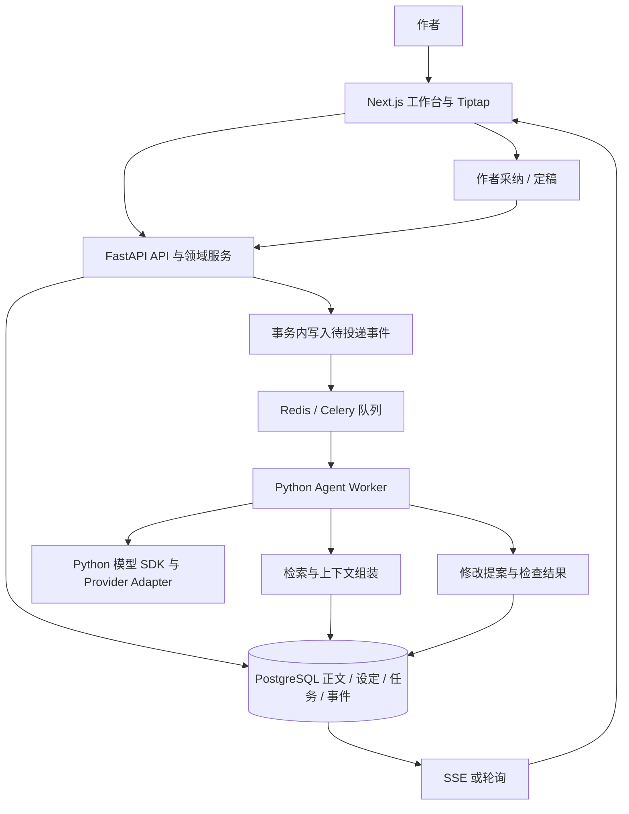
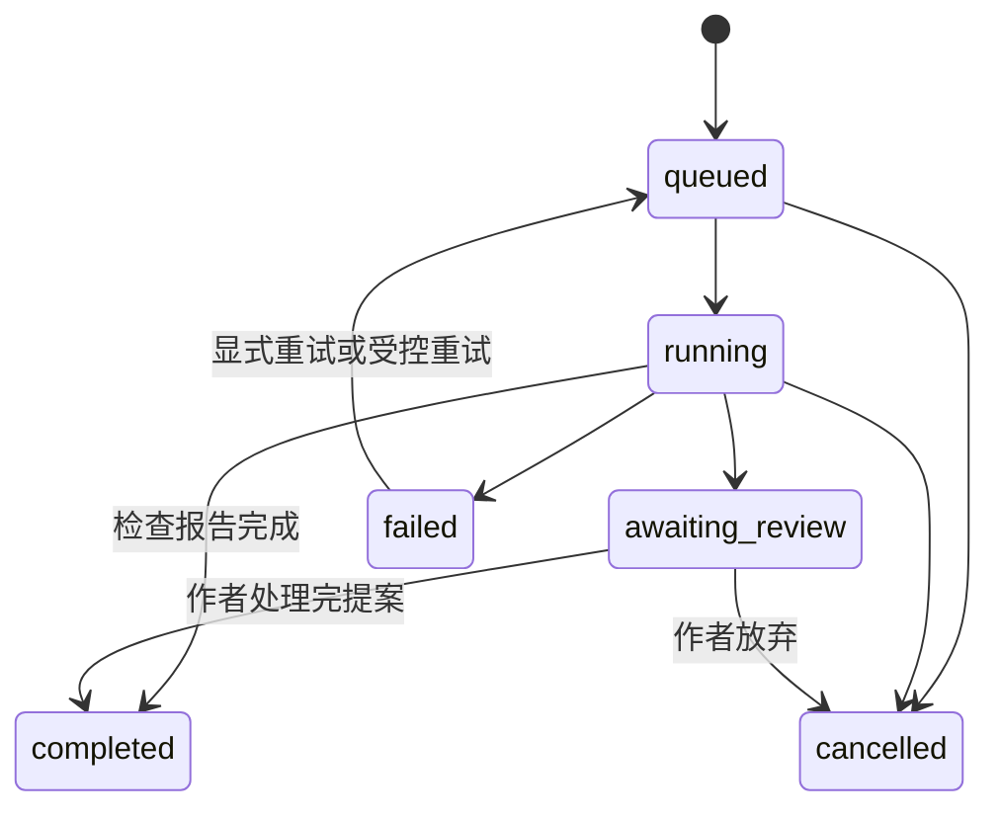

# StoryWeaver 小说协作 Agent：产品与技术方案

日期：2026-09-23。状态：推荐方案，尚未实施；后端已调整为 Python。

已确认方向：帮助作者规划、续写、改稿和检查一致性。本文中的“协作”指作者与 AI 协作；多人同时编辑作为后续能力。

## 1. 推荐决策

**沿用现有 TypeScript 前端，增加 Python API 与 Worker，构建以编辑器为中心的写作产品，采用一个主 Agent、明确的任务流程、可追溯的小说资料库和作者可采纳的修改提案。**

第一版技术组合：

| 层次       | 推荐选择                                           | 选择理由                                               |
| ---------- | -------------------------------------------------- | ------------------------------------------------------ |
| 前端工程   | 现有 pnpm + Turborepo + TypeScript                 | 复用仓库，负责工作台、编辑器和前端交互                 |
| 页面与交互 | Next.js App Router + Tiptap                        | 负责作者工作台、编辑器、差异展示和任务进度             |
| 后端 API   | Python 3.12+ + uv + FastAPI + Pydantic             | 适合 Agent API、结构化输出、权限和领域服务             |
| Agent 执行 | Python Worker + 自定义任务状态机                   | 长任务独立于浏览器连接，便于控制重试、版本和成本       |
| 模型调用   | Python 官方模型 SDK + Provider Adapter             | 保留不同模型的工具调用、结构化输出和流式能力           |
| 数据       | PostgreSQL + SQLAlchemy 2 + Alembic                | 正文版本、设定、任务和采纳操作有事务需求               |
| 后台任务   | Redis + Celery；数据库保存任务状态                 | Python 生态成熟，支持重试、并发和长任务                |
| 进度展示   | FastAPI SSE + 持久化事件；Redis 只做即时唤醒       | 刷新后能够从数据库重放事件，不依赖连接是否持续         |
| 检索       | 先做实体、章节和关键词检索；按评测引入 pgvector    | 第一阶段优先保证资料来源正确，再提升语义召回           |
| 测试       | pytest + 真实 PostgreSQL 集成测试 + Playwright     | 覆盖领域规则、事务与故障恢复，以及编辑器的实际用户路径 |
| 部署       | Next.js、FastAPI、Python Worker、PostgreSQL、Redis | API 与 Agent 生命周期独立，便于小规模内测              |

**第一件要做成的事：作者选中一段文字，描述修改要求，AI 引用相关设定给出修改提案，作者查看差异并采纳，版本可以回退。**

范围假设：由 1–2 人开发，先服务单作者、中文长篇创作和小规模内测。时间与成本在获得实际使用数据后调整。

## 2. 当前仓库与方案边界

检查时，仓库仍是 Turborepo 初始工程，尚未发现小说业务、数据库、编辑器或 Agent 实现。

| 已有内容      | 当前状态                       | 建议                                           |
| ------------- | ------------------------------ | ---------------------------------------------- |
| `apps/web`    | Next.js 16.3.4、React 19.2.8   | 作为作者工作台                                 |
| `apps/docs`   | 第二个 Next.js 初始应用        | 暂时保留，技术文档先放根目录 `docs/`           |
| `packages/ui` | 基础共享组件                   | 承载按钮、面板、差异展示等通用 UI              |
| TypeScript    | 7.0.2                          | 前端沿用已锁定的工程版本，新增依赖前验证兼容性 |
| Node.js       | 根配置要求 `>=24`              | 只作为前端工程运行时，开发与部署保持一致       |
| Python        | 后端版本在 M0 锁定，建议 3.12+ | API 与 Worker 使用同一 Python 主版本和锁文件   |

上表是本仓库配置的观察结果，不代表对这些版本的通用升级建议。本文没有修改依赖或搭建业务服务。

## 3. 产品范围与第一版体验

工作台采用三块区域：左侧章节与资料，中间正文编辑器，右侧 AI 请求、引用证据和修改提案。作者应能在正文上发起操作，并看清 AI 改了哪里、参考了什么。

### 3.1 第一版必须有的能力

| 能力         | 作者操作                                 | 交付结果                               |
| ------------ | ---------------------------------------- | -------------------------------------- |
| 作品管理     | 新建作品，填写题材、视角、风格与基本设定 | 独立作品空间                           |
| 资料管理     | 添加人物、地点、物品和世界规则           | 可编辑、可检索的资料卡                 |
| 规划         | 请求大纲、章节目标或场景安排             | 可采纳的规划提案，与已发生事实分开保存 |
| 续写         | 选择章节与插入点，说明下一段目标         | 插入提案，说明用到的设定和前文         |
| 局部改稿     | 选中文字，要求调整动机、节奏、对白或描写 | 修改前后对比，可按段接受或拒绝         |
| 一致性检查   | 选择当前章或相关章节                     | 带原文证据、位置和解释的问题列表       |
| 版本管理     | 自动保存、采纳修改、撤销或恢复           | 可查看的历史版本与作者操作记录         |
| 定稿与记忆   | 确认某版正文及其事实变更                 | 正式版本、事实来源与资料更新记录       |
| 任务管理     | 查看进度、取消、重试                     | 页面刷新后仍能找到任务和已保存的提案   |
| 基础导入导出 | 导入 TXT/Markdown，导出正文              | 作者能把现有作品带进来，也能带走       |

第一版暂缓整本自动生成、多人实时编辑、复杂分支宇宙、插图与音频、付费体系以及多 Agent 自由讨论。以后以实际需求和评测结果决定扩展顺序。

### 3.2 用一个具体场景贯穿开发

作者提出：“把第 8 章的背叛改成被迫的，但主角暂时不知道真相。”

系统应当：

1. 固定第 8 章的工作版本、当前定稿快照以及作者选区。
2. 找到背叛者的动机、主角当时的认知和涉及该事件的前后文。
3. 给出局部修改提案，标注修改位置和使用的资料。
4. 检查人物行为与前文是否矛盾、主角是否提前知道秘密。
5. 展示后续可能受影响的章节，供作者逐项处理。
6. 作者采纳后产生新的工作版本；定稿时再确认正式事实变更。

## 4. 参考项目怎样使用

| 参考                                                                          | 借鉴点                                            | 在 StoryWeaver 中的落点              |
| ----------------------------------------------------------------------------- | ------------------------------------------------- | ------------------------------------ |
| [AI_NovelGenerator](https://github.com/YILING0013/AI_NovelGenerator)          | 设定、章节规划、生成、定稿、状态更新的完整流程    | 定稿后的资料更新与章节生成流程       |
| [Long-Novel-GPT](https://github.com/MaoXiaoYuZ/Long-Novel-GPT)                | 大纲到正文逐层扩写，检索正文后改写并更新纲要      | 规划提案、已有小说改写、修改影响检查 |
| [Codex](https://github.com/openai/codex)                                      | 工具调用、上下文管理、任务会话、修改与检查        | Agent 执行机制、版本差异与可恢复任务 |
| [Claude Agent SDK](https://github.com/anthropics/claude-agent-sdk-typescript) | 可编程使用 Claude Code 能力，自定义工具与执行干预 | 快速原型、工具接口和模型执行边界     |

这些参考基于仓库文档与官方说明，尚未实测小说质量。借鉴顺序建议为：小说项目的定稿与改写流程 → 自己实现一次局部改稿 → 根据具体问题阅读 Codex 的相关模块。代码复用另按各仓库许可证评估。

### 4.1 Claude Code / Codex 的概念映射

| 编程 Agent           | 小说 Agent                       |
| -------------------- | -------------------------------- |
| 代码仓库与项目文档   | 正文、人物、世界规则、剧情规划   |
| 搜索定义和引用       | 搜索出场、事件、伏笔与相关描写   |
| 编辑文件             | 针对指定段落产生修改提案         |
| 检查与测试           | 一致性规则检查、基于证据的审稿   |
| 差异审阅与版本回退   | 作者接受、拒绝、撤销改稿         |
| 项目约束与上下文管理 | 叙事视角、风格约束、章节认知边界 |

文学效果需要作者判断。事实检查可以发现矛盾，但“是否好读、是否有张力”需要独立的人工评价。

## 5. 关键技术选型与取舍

### 5.1 Agent 框架：推荐 Python SDK 加领域状态机

| 方案                                 | 适用情况                                            | 本项目决定                                               |
| ------------------------------------ | --------------------------------------------------- | -------------------------------------------------------- |
| Claude Agent SDK                     | 需要尽快验证基于文件、工具和已有执行能力的 Agent    | 适合作为可选原型，正式产品仍需自己实现正文版本与事实事务 |
| Codex SDK                            | 希望在应用内控制 Codex 会话，或先验证文件式工作空间 | 适合作为可选原型；官方定位以本地 Codex Agent 集成为主    |
| Python 官方模型 SDK + 自定义领域流程 | 有明确编辑器、数据库、工具与多模型接入需求          | **正式产品推荐方案**                                     |
| 完整图式编排框架                     | 工作流出现大量分支、长期暂停恢复或复杂并行          | 根据实际复杂度在后续评估                                 |

Python 官方模型 SDK 负责模型请求、工具调用结果和流式输出。应用负责作品版本、任务状态、执行预算、断点和作者采纳。模型 SDK 的 Agent 循环与后台任务的持久化恢复是两个不同的层次。

一个主 Agent 可以在规划、检索、写作、审稿阶段使用不同提示和工具集合。先按任务类型固定外层流程，内部只在需要时允许受限的工具循环。第一版为单次任务配置明确的模型调用上限，避免自动审稿反复重写。

### 5.2 后端语言：改为 Python

后端统一使用 Python，前端继续使用 TypeScript。Python 负责 FastAPI、Agent、检索、记忆抽取和后台任务；Next.js 负责工作台和编辑器。前后端通过 OpenAPI/JSON Schema 生成或校验接口类型，不手工维护两套不一致的领域规则。

第一版使用 FastAPI + Pydantic、SQLAlchemy 2 + Alembic、Redis + Celery。Agent 循环先由项目自己的状态机控制；只有在需要复杂分支、长期暂停恢复或多 Agent 编排时，再评估 LangGraph 等框架。这样可以保留 Python 生态优势，同时避免把领域规则交给框架隐式管理。

### 5.3 数据库与队列：推荐 PostgreSQL + SQLAlchemy + Redis/Celery

正文采纳、版本指针与定稿事实需要事务。PostgreSQL 同时可承载任务、事件和后续向量检索。SQLAlchemy 2 用于类型化程度可控的查询与事务，Alembic 管理迁移；复杂的版本操作仍需明确设计 SQL、约束和事务边界。

Redis 作为 Celery Broker，Celery Worker 执行模型调用、记忆抽取和索引任务；任务状态、事件和最终结果以 PostgreSQL 为准。任务重试、进程退出和外部模型调用仍可能造成重复执行，所以业务写入必须具备幂等键和版本校验；队列特性不能替代这些规则。

第一版接受 Redis 这一额外基础设施，因为 Python Worker 需要可靠的后台队列。独立向量数据库与图数据库仍没有必需的业务负载；需要时以指标决定拆分，例如检索规模超出 pgvector 能力或关系遍历成为实际瓶颈。

### 5.4 编辑器：推荐 Tiptap，先做段落级修改

Tiptap 提供基于 ProseMirror 的编辑器框架。第一版采用开源核心与基础扩展；版本历史、修改提案和差异展示由 StoryWeaver 的业务数据实现，不假设付费的评论、跟踪修改或托管协作服务已包含在开源包内。

正文权威格式使用编辑器 JSON。纯文本、Markdown、检索片段都是可重新生成的派生数据。每个段落拥有稳定 ID；分段、合段或粘贴时维护 ID 与版本，避免依赖字符偏移定位修改。

### 5.5 模型：先评测，再锁定具体型号

先接入一个当前账号可稳定调用、支持所需工具调用和结构化输出的模型，跑通工程链路。评测时选择 OpenAI 与 Anthropic 的实际可用候选型号对照；中文文笔的优劣以作品样例的盲评为准。

第一版主写作与一致性检查可以使用同一个型号、不同任务提示。只有当抽取、摘要等任务达到验收标准后，再迁移到更便宜的型号。

配置中记录提供商、明确型号、任务角色与提示版本，不把型号写入领域逻辑。提供商切换需要验证工具调用、输出结构、流式行为和取消机制，统一 SDK 不意味着行为完全相同。

## 6. 总体架构与工程划分



以上是逻辑模块。`Outbox` 是数据库里的待投递记录，投递器将任务发送到 Redis/Celery；它不要求增加独立业务服务。API 在同一事务写入任务和待投递记录，避免数据库成功而任务未入队。任务状态和事件以 PostgreSQL 为准，Redis 只负责调度和唤醒。

建议按里程碑逐步新增以下目录，不必一次性创建全部空包：

```text
apps/
  web/                  # 已有：编辑器、作品页面和前端事件消费
  docs/                 # 已有：暂保留
backend/
  pyproject.toml        # Python 依赖与工具配置
  src/storyweaver/
    api/                # FastAPI 路由、鉴权和 SSE
    domain/             # 版本、提案、定稿与事实规则
    db/                 # SQLAlchemy schema、Alembic 迁移、事务
    agent/              # 流程、工具、上下文、模型适配
    worker/             # Celery 任务、记忆抽取、索引更新
    retrieval/          # 精确检索与后续 pgvector
packages/
  ui/                   # 已有：共享界面组件
docs/
  novel-agent-technical-plan.md
```

`domain` 不依赖 FastAPI、Celery 或模型 SDK。API 和 Worker 通过同一 Python 领域模块修改业务数据；Worker 不另写一套采纳与定稿规则。模型返回值经过 Pydantic 和领域校验后才进入领域服务。前端类型通过 OpenAPI/JSON Schema 生成或校验，不把领域逻辑复制到 TypeScript。

## 7. 正文、记忆与数据设计

### 7.1 先划分四类内容

| 类型                 | 示例                       | 使用规则                           |
| -------------------- | -------------------------- | ---------------------------------- |
| 正式设定与已确认事实 | 世界规则、已经定稿的事件   | 带版本与来源，是一致性判断依据     |
| 未来规划             | 第 20 章揭示幕后人物       | 写作方向，不能被当作已经发生的事件 |
| 当前工作稿           | 第 8 章尚在修改的正文      | 可作为续写上下文，但必须标记未定稿 |
| AI 提案与推测        | 建议人物因亲属被挟持而背叛 | 待作者采纳，不能自动进入正式事实   |

**自动保存、采纳改稿、确认定稿是三个独立动作。** 采纳 AI 文字只更新工作稿；作者定稿时才确认正式正文和相关事实。

事实抽取结果也需要区分“明确发生”“人物认为”“作者计划”“模型推断”。人物撒谎、误解或不可靠叙述不能直接写成世界真相。作者主动填写的设定可以以“作者设定”为来源。

### 7.2 第一版核心数据

| 数据                             | 关键内容                                | 设计约束                                 |
| -------------------------------- | --------------------------------------- | ---------------------------------------- |
| `projects`                       | 作者、作品设定、风格、`canon_epoch`     | 作品范围从服务端身份确定                 |
| `chapters`                       | 排序、工作版本指针、定稿版本指针        | 章节 ID 稳定，序号允许变化               |
| `document_revisions`             | 编辑器 JSON、父版本、操作来源、内容哈希 | 已保存版本不可变，纯文本可重新派生       |
| `entities`                       | 人物、地点、物品、别名                  | 对应描述的修订纳入定稿快照               |
| `story_facts`                    | 主体、关系、内容、时间、认知者、来源    | 支持撤回或被新版取代，保留历史           |
| `outline_items` / `plot_threads` | 章节目标、伏笔、预期回收位置、状态      | 计划与实际发生分别标注                   |
| `change_sets` / `change_items`   | 修改理由、原版本、目标段落、替换内容    | 支持部分采纳与过期检测                   |
| `agent_runs` / `run_steps`       | 任务输入、状态、尝试次数、预算与检查点  | 任务与浏览器连接解耦                     |
| `run_events`                     | 递增事件序号、阶段、文本批次、结果引用  | 支持按游标重放                           |
| `memory_candidates`              | 候选摘要与事实、提取来源版本            | 绑定准确的正文版本，过期候选不可直接定稿 |
| `outbox_events`                  | 任务投递、索引失效等待处理事件          | 与对应业务修改在同一事务写入             |

P0 可以先实现作品、章节、正文版本、提案和任务；其他表在对应功能阶段加入。表名是建议，不是已有实现。

### 7.3 事实需要时间与认知范围

例如“林岚知道钥匙是假的”，至少要关联：

- 对应作品、人物与事实类别。
- 事实从哪个场景起成立，是否在某个场景后失效。
- 谁知道该事实，以及何时获知。
- 信息来自哪个正文版本、段落或作者设定。
- 确认状态，以及在哪个定稿快照中有效。

剧情发生时间与读者看到的章节顺序需要分开。第一版优先支持线性叙事；倒叙场景通过显式时间或前后关系标记，时间不明时返回待确认问题，不猜测时间顺序。

规划者上下文可以包含未来安排；角色视角的正文生成上下文应按场景时间、人物认知和叙事要求过滤。全知叙述是否可透露信息由作者设定控制。

### 7.4 上下文组装

一次改稿任务按下面的顺序组装信息：

1. 作者此次请求、选区与明确约束。
2. 目标工作版本及选区前后的完整段落。
3. 必须遵守的已确认世界规则与相关人物状态。
4. 当前章节目标、视角和风格要求。
5. 相关历史场景与证据原文。
6. 必要的摘要与未来规划，明确标注各自身份。

每个资料片段都携带来源版本和段落引用。为输出预留空间；超预算时优先裁剪低相关资料，保留硬约束与引用证据。记录本次实际使用的资料，方便解释结果和复现问题。

检索第一阶段使用实体别名、章节范围、剧情关联和关键词。中文正文的语义检索需要实际评测，不能把默认全文检索配置视为已经解决中文分词。第二阶段再加入 pgvector，组合精确条件与向量召回，检查作品与版本过滤后的召回效果。

## 8. 修改提案、采纳与定稿

### 8.1 使用结构化提案

下面是建议的领域数据结构，不是某个 SDK 的 API：

```ts
type ChangeItem = {
  id: string;
  chapterId: string;
  baseRevisionId: string;
  baseCanonEpoch: number;
  operation: "replace" | "insert_after" | "delete";
  targetBlockIds: string[];
  expectedContentHash: string;
  replacementBlocks: Array<{ type: "paragraph"; text: string }>;
  reason: string;
  evidence: Array<{ revisionId: string; blockId: string }>;
  dependsOnItemIds: string[];
};
```

模型输出段落文本和有限操作，服务端负责生成合法编辑器节点及稳定 ID。P0 支持段落替换和插入；涉及复杂表格、任意 HTML 或任意文档路径的操作不在第一版范围。

### 8.2 采纳流程

1. 作者选择要接受的修改项。存在依赖的修改项一起接受，或先重新生成可独立采用的提案。
2. 服务端校验权限，先查询当前作品下的幂等键是否已有完成结果，再校验当前工作版本、定稿快照以及目标段落哈希。
3. 如果作者在等待期间改过正文，返回冲突，保留提案供比较或重生成。
4. 在一个短事务内应用兼容的修改项，写入新正文版本、更新指针，并标记提案采纳结果。
5. 在同一事务保存采纳请求的幂等结果，重复点击或超时重试返回既有结果，避免重复插入正文。
6. 同一批次的兼容修改合并应用到一个新版本；尚未采纳的剩余项重新校验后再处理。

第一版采用保守的整章版本校验。即便段落内容没变，只要基础版本变化，也先提示刷新提案。稳定段落 ID 为以后做安全的局部重定位保留空间。

### 8.3 定稿流程

1. 基于准确的工作版本生成摘要和候选事实；模型调用发生在数据库事务之外。
2. 作者查看正式正文、候选事实及已有设定冲突，确认或修正。
3. 短事务内校验工作版本和 `canon_epoch` 未变，更新定稿指针、确认事实及事实修订，递增 `canon_epoch`，写入索引更新事件。
4. 后台更新检索片段、摘要及关联影响报告；所有派生结果标记来源版本。

模型记忆抽取失败时，工作稿已经保存，定稿准备状态可重试。事务中不等待模型；定稿确认提交失败时整个事务回滚。

### 8.4 修改前文与恢复旧版

工作稿修改使依赖旧工作版本的提案和派生资料过期，正式事实在再次定稿确认后更新。正式版本变化时，将直接引用被替代版本的摘要、事实候选和检索片段标为失效，再检查相关人物、事件及后续章节。生成“可能受影响”的报告供作者处理，影响检索无法保证找全所有文学关联。

查询同时校验派生资料的来源版本仍属于本次选定的工作版本或定稿快照，不能只依赖后台失效标记。这样即使索引更新事件尚未执行，旧版本资料也不会进入新任务。索引落后时读取当前版本原文或提示等待。

恢复旧正文应创建一个新的工作版本。若要让它重新成为定稿，仍经过定稿流程并更新事实快照，不能只改变正文指针而继续使用后来的记忆。

## 9. Agent 流程与工具边界

### 9.1 外层任务状态



`running` 内部按任务类型执行检索、规划、生成和检查等步骤。`awaiting_review` 已释放 Worker，不保持等待作者的模型请求。检查类任务生成报告后可直接完成；有修改提案的任务在作者处理后完成。

`completed` 表示任务结束，不等同于小说已经定稿。修改项和正文定稿各自拥有状态。

### 9.2 推荐工具集合

| 工具                        | 作用                       | 执行边界                   |
| --------------------------- | -------------------------- | -------------------------- |
| `get_chapter`               | 读取指定版本正文           | 只读，必须属于当前作品     |
| `search_story`              | 搜索人物、事件与历史片段   | 只读，返回来源与版本       |
| `get_character_state`       | 获取某场景的人物状态和认知 | 只读，按时间与定稿快照筛选 |
| `get_outline`               | 读取大纲、章节目标和伏笔   | 只读，注明计划身份         |
| `propose_outline`           | 提交规划建议               | 只创建提案                 |
| `propose_changes`           | 提交结构化正文修改         | 只创建提案，不能覆盖正文   |
| `report_consistency_issues` | 提交带证据的问题列表       | 不直接修改正式事实         |
| `propose_memory_updates`    | 提交候选摘要与事实         | 与来源版本绑定，等待确认   |

采纳正文与提交定稿由作者操作触发的领域 API 执行。工具权限来自服务端上下文；模型不能通过传入另一个作品 ID 获取额外权限。

工具返回错误时只做有限重试，并保留原因。审稿发现事实冲突时报告给作者；自动重写默认最多进行一次，超过预算则返回已有结果与未解决问题。

### 9.3 长任务、取消与恢复

- 提交任务时返回 `runId`；浏览器订阅事件，断开连接不取消后台任务。
- 任务保存输入正文版本、事实快照、提示版本、模型配置，以及已完成步骤的输入输出。
- Worker 使用执行租约、心跳和尝试编号；写结果前确认当前尝试仍有效，防止过期 Worker 回写。
- 模型输出文本按短批次写入事件表，不为每个 token 单独写一条记录。
- 取消操作写入任务状态，并尝试中断模型请求；每次工具执行和最终写结果前再次检查取消标记。
- 进程崩溃后从已提交的步骤检查点恢复。中断中的模型调用可能需要重新生成，无法承诺从最后一个 token 精确续接或免除重复计费。
- 队列重复投递、提案写入、事实提交和索引任务都使用业务幂等键；已经确认的正文不会因任务重试再次应用。
- 重连 SSE 使用已消费事件序号补读；事件接口始终校验作品与任务归属。

## 10. API 草案

下表用于拆任务，路径与载荷在实施时再锁定。所有修改正文的接口都需要版本前置条件。

| 接口                                          | 用途                       | 关键字段或结果                            |
| --------------------------------------------- | -------------------------- | ----------------------------------------- |
| `POST /api/projects`                          | 新建作品                   | 作品设定、风格与初始规划                  |
| `POST /api/projects/:id/chapters`             | 新建章节                   | 标题、顺序、初始正文                      |
| `PUT /api/chapters/:id/draft`                 | 保存工作稿                 | `baseRevisionId`、编辑器 JSON，返回新版本 |
| `POST /api/agent-runs`                        | 发起规划、续写、改稿或检查 | `taskType`、请求、版本、选区、幂等键      |
| `GET /api/agent-runs/:id`                     | 恢复页面、读取任务状态     | 状态、提案、最近事件序号                  |
| `GET /api/agent-runs/:id/events`              | SSE 或按游标读取事件       | 事件游标、阶段、内容批次                  |
| `POST /api/agent-runs/:id/cancel`             | 取消任务                   | 幂等取消结果                              |
| `POST /api/change-sets/:id/accept`            | 采纳指定修改项             | 修改项 ID、当前版本、幂等键               |
| `POST /api/chapters/:id/prepare-finalization` | 提取候选记忆               | 准备任务 ID、来源版本                     |
| `POST /api/chapters/:id/finalize`             | 确认定稿                   | 候选事实、工作版本、`canonEpoch`          |
| `POST /api/chapters/:id/restore`              | 将历史正文恢复为新工作版   | 目标旧版本、当前版本、幂等键              |

结构错误与权限错误直接返回；并发版本冲突返回可识别的冲突结果，例如 HTTP 409。错误信息应说明需要刷新、重生成还是重试，已经产生的稿件与提案保留。

## 11. 质量评测与模型选择

### 11.1 先建立一套小而固定的中文评测集

建议使用作者自己的样章或获准使用的材料，建立 20 个任务：

| 类型           | 数量 | 主要检查内容                               |
| -------------- | ---- | ------------------------------------------ |
| 场景与章节规划 | 4    | 目标明确、人物动机可解释、冲突递进         |
| 接续前文       | 4    | 视角与语气连贯、时间与状态正确             |
| 局部改稿       | 4    | 遵守修改范围、满足意图、保留必要信息       |
| 一致性检查     | 4    | 同时包含真实冲突与无冲突对照，要求原文证据 |
| 记忆与认知范围 | 4    | 排除废弃草稿、未来知识和人物误解           |

使用相同输入与相近输出长度测试候选型号，记录完整型号、日期、参数、提示版本和资料集合。作者盲评优先；模型评价用于辅助，不能代替作者选择。

### 11.2 推荐评分与验收

| 维度               | 建议权重 | 评估方式                                     |
| ------------------ | -------- | -------------------------------------------- |
| 事实与时间一致性   | 30%      | 对照人工标注的事实与认知范围                 |
| 遵循修改意图       | 25%      | 检查要求、修改范围和明确禁改内容             |
| 中文表达与人物声音 | 25%      | 作者盲评，记录偏好与理由                     |
| 叙事推进与节奏     | 10%      | 检查场景目标、动机与信息安排                 |
| 成本与延迟         | 10%      | 比较同类任务的实际用量、首个可用结果与总耗时 |

初步验收目标：

- 版本冲突、重复采纳、回退、取消与恢复的确定性测试全部通过。
- 对人工标注的一致性问题分别统计精确率和召回率；初期目标均达到 80%，按问题类型展示结果。
- 作者至少愿意采纳或仅做少量调整的生成任务占比达到 70%。
- 废弃提案、旧索引、其他作品内容和不应出现的未来知识不进入约束测试的正文上下文。

这些数字是建议门槛，不是已达到的性能。20 个任务用于选型和回归起步；正式扩大内测前补充到至少 50 个，并增加正常文本、长上下文和不同题材样例。

### 11.3 必须覆盖的工程测试

1. 作者在生成期间修改正文，旧提案采纳被拦截。
2. 同一提案重复采纳、网络重试和队列重复投递不会重复插入文字。
3. 接受一部分修改项后，剩余修改项不能盲目应用到新版本。
4. 章节改稿后，引用旧版本的记忆与索引被排除。
5. 撤销改稿与恢复定稿时，正文和事实快照不会脱节。
6. 浏览器刷新、Worker 退出、模型限流与任务取消后状态可解释、已有结果可恢复。
7. 中文输入法组词、选区、分段合段、撤销重做和自动保存不会互相覆盖。
8. 同一角色在两个不同场景中的认知与物品状态符合时间约束。

单元测试覆盖规则；真实 PostgreSQL 测试覆盖并发、事务和恢复；端到端测试覆盖“选区 → 提案 → 采纳 → 回退”。

## 12. 成本、部署与运行方式

### 12.1 每次任务设置预算

按任务类型配置最大模型调用次数、输入输出 token、总运行时间和自动修订次数。例如局部改稿可以先用 4–6 次模型调用作为调试上限，检索工具另设次数和返回数据量上限，再根据评测收敛。格式修复、自动重试与自动修订都计入任务预算，取消和预算检查在每次新调用前执行。

任务的成本估算应汇总各模型调用的输入、缓存输入、输出与适用的额外计费项，按记录的价格版本计算。具体价格以实施时的官方价格表为准，当前文档不估造单章成本。

优先通过缩小修改范围、按需检索、复用仍有效的摘要与减少无效循环降低费用。待质量验证后再调整模型档位。

### 12.2 部署建议

本地开发使用 Web、FastAPI、Python Worker、PostgreSQL 和 Redis。小规模内测采用 Next.js、FastAPI、Celery Worker、一个持久化 PostgreSQL 实例和一个 Redis 实例，正文备份与定期恢复演练纳入运行工作。

Web 可以独立部署到合适的平台；后台生成始终由支持常驻进程的 Worker 承担。SSE 断开后用事件游标重连，运行时间不依赖某个平台的 HTTP 请求时限。

本机单作者原型可以暂缓登录功能；开放远程内测前接入身份验证。作者 ID 从服务端会话获取，作品、版本、任务与引用查询统一校验归属。模型密钥存于服务端配置，浏览器只调用业务 API。

第一版只需要正文与 TXT/Markdown 导入导出。出现图片、附件或大型导出文件后，再增加对象存储。

### 12.3 运行指标

记录任务成功率、失败阶段、各步骤耗时、模型用量、提案采纳率、版本冲突率、记忆索引延迟和一致性检查误报率。日志用任务 ID、版本 ID 和引用定位，避免默认重复保存整本正文。

监控应能回答：作者在哪一步等得最久、为什么重试、哪种修改最常被拒绝、失败是否导致重复费用或重复应用。

## 13. 实施顺序与里程碑

下面按一名熟悉 TypeScript 和 Python 的全栈开发者估算，总体约 4–6 周。实际排期取决于编辑器经验、模型响应质量与每天投入时间，各阶段以验收结果推进。

| 阶段                 | 参考投入     | 主要工作                                           | 完成标准                                           |
| -------------------- | ------------ | -------------------------------------------------- | -------------------------------------------------- |
| M0：可验证的写作原型 | 2–3 个工作日 | 准备样章和 20 个评测任务，验证上下文与局部改稿提示 | 获得可比较的提案样例，明确最常见错误               |
| M1：可靠编辑器       | 4–5 个工作日 | 作品、章节、Tiptap、保存、不可变版本、导入导出     | 写作不会丢失，版本冲突可处理，正文可回退           |
| M2：一次完整 AI 改稿 | 4–6 个工作日 | Worker、队列、任务事件、局部改稿、差异采纳         | 选区改稿全流程可用，刷新、取消、重试有明确行为     |
| M3：规划、续写与记忆 | 5–7 个工作日 | 资料卡、大纲提案、续写、定稿与事实确认             | 可连续写作，多章上下文来源正确，草稿不污染正式设定 |
| M4：一致性与内测     | 4–6 个工作日 | 冲突报告、前文修改影响、故障测试、评测与观察指标   | 用一部 5–10 章试验作品完成写作和多轮修改           |

M0 的脚本只验证模型输入输出，可以同步执行。进入产品的 M2 时再接入持久化任务、取消和恢复；不要把原型脚本直接当成长期任务服务。

### 第一周建议清单

- 选一部作品，准备人物、基本设定、两章正文和典型修改要求。
- 建立评测记录，先跑通一次基于证据的局部改稿。
- 实现作品、章节、正文不可变版本与工作版本指针。
- 接入编辑器，验证中文输入、选区、自动保存和冲突提示。
- 定义修改提案的结构与采纳事务，先用固定样例验证。

### 第一版发布门槛

作者能够导入自己的作品，规划下一章，完成续写与局部改稿，查看问题证据，选择采纳，并恢复旧稿。连续修改前文后，系统能排除旧记忆并指出需要复查的后文。

如果局部改稿经常越界、正文可能丢失、记忆持续污染或任务恢复不可靠，先完成这些问题再扩大自动化范围。

## 14. 后续扩展的触发条件

| 扩展方向             | 何时值得做                                                        |
| -------------------- | ----------------------------------------------------------------- |
| pgvector 语义检索    | 精确实体与关键词检索持续漏掉评测中的相关场景                      |
| 独立审稿 Agent       | 分阶段审稿已验证有效，且需要独立上下文或执行策略                  |
| 并行检查             | 事实、节奏、人物声音等检查可以独立执行，并有统一的去重合并规则    |
| 批量章节生成         | 单章质量、资料更新和故障恢复稳定，作者需要半自动连载              |
| 实时多人编辑         | 出现明确的共同作者与编辑协作需求                                  |
| 图数据库             | 关系遍历成为实际查询瓶颈，关系模型已经稳定                        |
| LangGraph 等编排框架 | 任务出现复杂分支、长期暂停恢复或多 Agent 协作，简单状态机难以维护 |
| 商业化功能           | 已有稳定使用与支付需求，能度量每位作者的使用成本                  |

## 15. 已核对资料与待验证事项

资料核对日期：2026-09-20。当前会话没有可调用的 Context7 MCP，因此直接读取官方文档与项目仓库。实施时优先按项目要求使用 Context7 查询所选库，并锁定实际依赖版本。下列“支持某能力”来自资料，“本项目采用某方案”是本文的设计建议。

| 资料                                                                                  | 本文使用的依据                           |
| ------------------------------------------------------------------------------------- | ---------------------------------------- |
| [FastAPI](https://fastapi.tiangolo.com/)                                              | Python API、请求校验和 SSE 的实现入口    |
| [Pydantic](https://docs.pydantic.dev/latest/)                                         | 结构化模型输出和 API schema 校验         |
| [SQLAlchemy 2](https://docs.sqlalchemy.org/en/20/)                                    | Python 数据访问、事务和连接管理          |
| [Alembic](https://alembic.sqlalchemy.org/en/latest/)                                  | 数据库迁移                               |
| [Celery](https://docs.celeryq.dev/en/stable/)                                         | Python 后台任务、重试和 Worker           |
| [Tiptap Overview](https://tiptap.dev/docs/editor/getting-started/overview)            | 编辑器框架、扩展机制及开源与付费能力边界 |
| [Tiptap Persistence](https://tiptap.dev/docs/editor/core-concepts/persistence)        | 文档持久化格式                           |
| [pgvector](https://github.com/pgvector/pgvector)                                      | PostgreSQL 向量检索、过滤与索引取舍      |
| [Codex SDK](https://learn.chatgpt.com/docs/codex-sdk)                                 | 通过 SDK 控制、继续与恢复本地 Codex 会话 |
| [Codex 源码](https://github.com/openai/codex)                                         | 工具、上下文、会话与相关模块的阅读入口   |
| [Claude Agent SDK Python](https://github.com/anthropics/claude-agent-sdk-python)      | 在 Python 应用中接入 Claude Code 能力    |
| [AI_NovelGenerator](https://github.com/YILING0013/AI_NovelGenerator)                  | 小说生成、定稿、状态更新与检查流程       |
| [Long-Novel-GPT](https://github.com/MaoXiaoYuZ/Long-Novel-GPT)                        | 层级扩写、检索改写和纲要同步             |
| [Vitest](https://vitest.dev/guide/) / [Playwright](https://playwright.dev/docs/intro) | 单元与浏览器端到端测试工具的选型依据     |

尚需在 M0–M2 验证：候选模型的中文写作表现与单次任务成本；Python 3.12+ 与 FastAPI、SQLAlchemy、Celery 的兼容性；OpenAPI schema 与前端类型同步；段落 ID 在编辑操作中的稳定性；队列故障恢复与模型请求取消；长篇检索召回率。以上均未通过这份文档获得实测结论。
